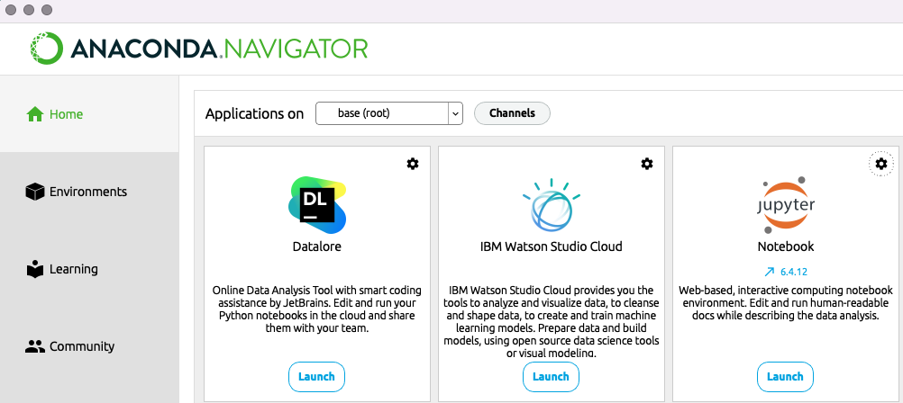
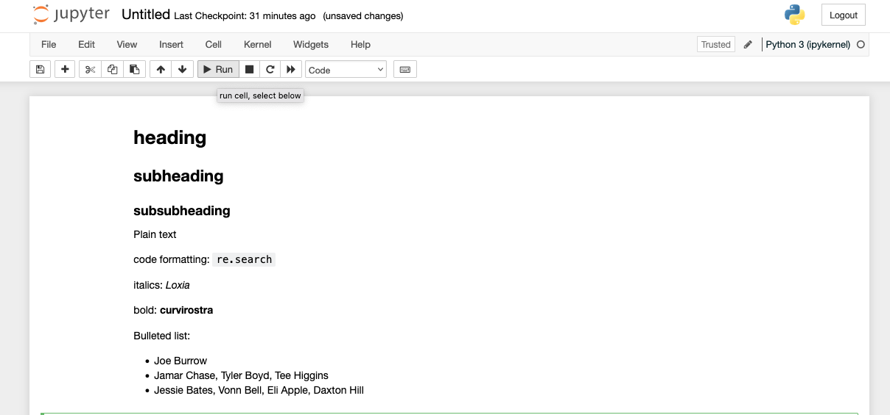
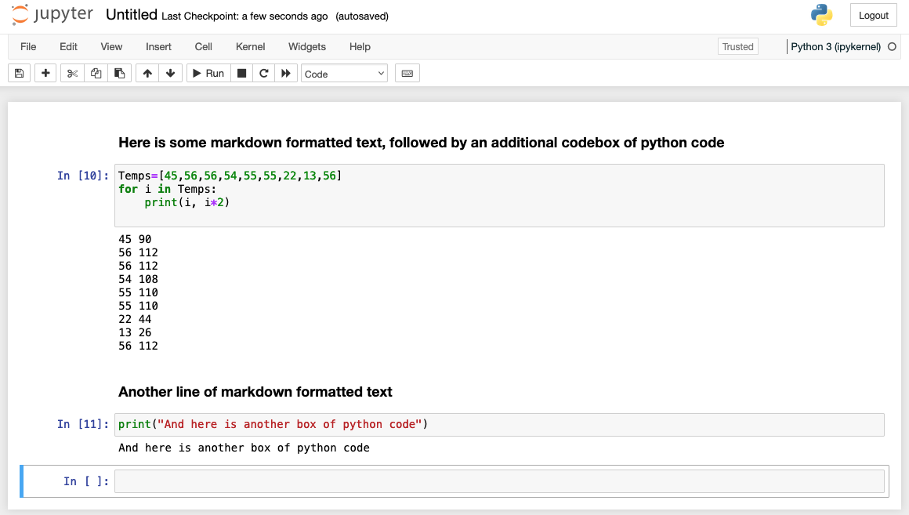

## Jupyter notebooks to organize and annotate python

Jupyter notebooks offer an environment where you can write, run, and annotate python code using code boxes that can be specified as either markdown or python. It is ideal for providing descriptions or annotations of code in easily readable markdown

## Installing Jupyter

Jupyter is an independent software for writing and executing python and markdown code. Before you can get started writing and displaying code using Jupyter notebooks, you will need to install this software. Below are three ways to approach this.

I. If you prefer command line access and opening files from the command line, you can easily install `Jupyter` using `pip`, `brew`, or `conda`. 

Install with `pip` (installation tool built into python).

    $ pip install jupyter

Once `Jupyter` is installed, you can open a notebook from anywhere with:

    $ jupyter-notebook

You can click the `new` button on the top right of this window, and select `python3` to open an untitled workbook in the current working directory. You can save this file as whatever you like (in the current working directory) by clicking on `save as` under the `file` menu.

II. Many of you have already installed the Anaconda Navigator suite of GUI applications. You can start Jupyter from the `Jupyter Notebook` icon in the application menu. 

Once you do that, a `Jupyter` server will launch on your screen that will display Jupyter in an html viewer within your default web browser. Note that this is not a connection to an internet site, but an interactive html based application. From here you can navigate your directory tree to open an already existing `Jupyter Notebook` or can click on `new` to create a new file. The menu bar at the top should be largely self explanatory and self explorable.

Once you open a new `Jupyter Notebook` it will display a menu at the top and a blank box with a cursor. There is a drop down menu on the right where you can switch between code and markdown to control how you what you type in each box is interpretted, shown in the image below. 

## Writing markdown in code boxes

Markdown is a simple markup language for creating formatted text using a plain-text editor that renders into simple and easily readable formatted html. Markdown is widely used software documentation pages, readme files, and is the languate used to write the primers I have created for this course. 

Due to its simplicity, markdown is very effective for annotating and describing python code. You can keep it as simple as just writing in plain text, or you can use more detailed formatting, including different font sizes for headers and subheaders, bulleted lists, code boxes to demo commands, and font formatting such as bold and italics.

To write markdown in a jupyter code block, start by selecting markdown from the dropdown menu on the upper right. Then type whatever you intend into the code box. The image below shows an example of what raw markdown looks like for several features it enables.

To process, or render, the markdown into how it should appear in html, click the `run` button on the top menu. The raw markdown above will be processed into html as below.

## Writing python in `Jupyter`

There is little explanation needed here. Just select python3 from the code selection menu when you highlight a new code box, and proceed to write python code. Once you run the code boxes, the python code will be processed. If there is stdout, it will be printed below the code box. Image below shows some simple examples.

There are limitations here, in that loops must be fully contained within a single code box. So if you have a set of four nested loops, they can not be interrupted by boxes of markdown, or separate boxes of python.

Variables generated and stored in previous code boxes, however, are available in subsequent code boxes, so be conscentious of scope. For the most part, you should learn quickly that using `Jupyter Notebooks` is a pretty easy way to write organized python code.

## Exporting from `Jupyter`

There are options for exporting different types of files from `Jupyter`.

## 